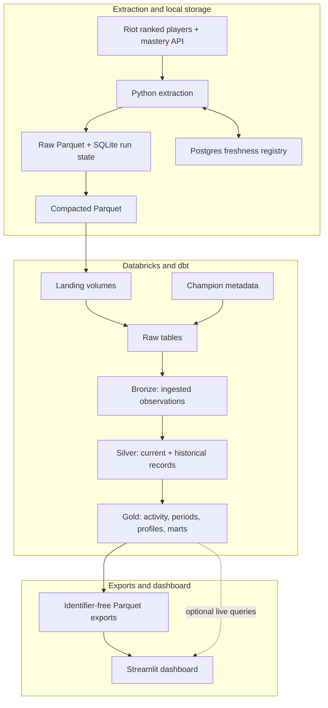

# League Specialization ETL

How does concentrating play on a smaller set of champions relate to ranked progression in League of Legends?

I built this project as a software developer moving from mobile games into data engineering. It is both an attempt to investigate a popular advice of improving by minimizing learning scope and a portfolio of the engineering required to study that question: API collection under rate limits, historical data modeling, checks across pipeline stages, and an interactive dashboard. The data can reveal associations in the **tracked sample**; they cannot show that specializing causes a player to climb.

In League of Legends, a player chooses a champion for each match. Ranked players occupy tiers and divisions and gain or lose League Points (LP). Champion mastery is a cumulative measure of experience with each champion. This project observes rank and mastery at intervals rather than collecting each match, then estimates how champion-pool choices relate to rank movement.

## What the project answers

- How concentrated are players' current, lifetime, and observed-period champion pools?
- How does concentration relate to rank movement within comparable starting tiers?
- How do players associated with a champion differ by tier, inferred role, playstyle, mastery depth, and observed growth?
- Which champions tend to coexist in the same players' active pools?

The original research brief also called for examining mastery, win rate, recent activity, champion population across tiers, and champion selection patterns. The implemented views cover parts of that brief through the available snapshots and derived marts; they should not be read as a complete answer to every original question.

The initial expectation was that specialization might show a noticeable rank-growth advantage, perhaps varying by champion, role, and tier. The project expanded from one-time player profiles to temporal analysis because a single snapshot could describe *who* played a champion but not how their choices and rank changed together. Champion attribution, ranked-mastery share, and roles remain estimates because the data do not join individual ranked matches to champions, lanes, and results.

## Current state

The repository contains an end-to-end **extract, load, transform, and serve** path:

| Part | Implemented here | Detail |
|---|---|---|
| Collection | Riot API player and mastery extraction, local state and integrity checks, stale-player refresh | [Extraction code](src/extract/) |
| Loading | Parquet compaction, Databricks landing-volume uploads, champion metadata load, and a Databricks ingestion notebook | [Loading code](src/load/) |
| Transformation | dbt Bronze, Silver, and Gold models, schema tests, and business-rule tests | [dbt project README](league_pipeline/README.md) |
| Presentation | Streamlit Overview, Population Analysis, Cross Champion View, and Champion Explorer, using included Parquet exports by default | [Dashboard README](streamlit_app/README.md) |
| Orchestration | A deployed Databricks job for ingestion and layer-by-layer dbt builds, with its definition versioned here | [Job definition](resources/ingest_clean_transform.job.yml) |

The included dashboard files are a **snapshot**, not a live feed. Their export timestamp and coverage are recorded in the [snapshot manifest](streamlit_app/data/manifest.json). The dbt README records the most recent documented full and incremental build; those results describe that validation run, not every future run. A public dashboard deployment is still planned.

## How the project developed

The first extractor fetched ranked players and mastery and wrote JSON. It proved the idea, but had no durable task tracking, concurrency controls, integrity checks, or historical analysis. I added partitioned Parquet, a local SQLite run and file ledger, retries, logging, pagination, and rate-limit-aware concurrent requests. A separate Postgres registry now tracks which players need refreshing across collection cycles and machines.

The decisive change was to collect repeated observations. Differences in cumulative mastery and ranked wins, losses, and LP made week-scale player histories possible. Early local Pandas exploration suggested enough analytical value to move the transformation work into dbt on Databricks rather than formalize a temporary local transformation layer. Databricks provides the table storage, compute, job tracking, and inspection tools for this stage of the project. The dashboard grew from the resulting Gold marts.

This took roughly three months of self-directed work. The main lesson was that the game data made the engineering problem larger than expected: broad champion, role, and tier coverage with a personal API key demanded careful collection and explicit estimates. The [engineering journey](docs/engineering_journey.md) records the decisions, problems, and tradeoffs behind the final architecture.

## Data flow



The extractor scans configured ranked tiers and divisions, fetches mastery for discovered players, and revisits stale players. It records runs, tasks, files, and failures in local SQLite. A separate Postgres player registry supports freshness and refresh claims across collection cycles. Before upload, raw Parquet files are compacted. The Databricks ingestion notebook loads landed player and mastery files into raw tables; champion names and reference positions are loaded separately.

dbt preserves useful history and produces current records, rank periods, champion activity, player profiles, and champion marts. Fixed export queries create the public dashboard datasets and exclude player and interval identifiers. The optional live dashboard mode reads the Gold schema directly. See the [model reference](league_pipeline/docs/model_reference.md) for model grains, lineage, metric definitions, and interpretation edge cases.

## Analytical method

1. **Sample ranked players.** The extractor pages through configured tiers and divisions, initially for North America solo queue. The aim was roughly even coverage by tier, which deliberately differs from the actual ranked population; an earlier collection bug also overrepresented Diamond through Platinum. Tier-specific comparisons therefore matter more than an unqualified overall average.
2. **Observe repeated snapshots.** Ranked entries provide tier, division, LP, and cumulative wins and losses. Champion-mastery entries provide cumulative mastery points and last-play information. Differences between snapshots, not individual match events, supply the historical activity signal.
3. **Measure rank movement.** A project-defined rank score allows movement across division boundaries. Completed observations are grouped into configured seven-day buckets, chosen to fit weekly play patterns while limiting API calls. Eligible growth is reported as LP per recorded ranked game, then compared with the tracked sample's baseline for the same queue and starting tier. The current growth filter excludes periods with absolute movement above 50 LP per game to reduce the impact of unobserved rank changes.
4. **Describe specialization.** The models calculate leading-champion share, concentration, entropy, and a favoured-champion subset for active, lifetime, or period pools. Exploratory clustering and game knowledge informed four profiles; a weighted, configurable dbt heuristic assigns specialist, multispecialist, versatile, or generalist. These are descriptions of measured pool shape, not validated behavioral types or skill grades.
5. **Associate champions with outcomes.** Mastery gained during a period supplies weights for allocating that period's rank movement and games to favoured champions. The resulting champion figures are associations, not observed wins or LP earned while playing that champion. Champion summaries first aggregate within players so those with many periods do not automatically dominate the final average.
6. **Compare and inspect.** Gold marts summarize players, champions, tiers, playstyles, and champion-pair overlap. The dashboard exposes support counts and controls for sparse groups. Co-occurrence measures shared player preference, not team synergy.

The precise formulas, thresholds, model grains, and edge cases live in the [dbt model reference](league_pipeline/docs/model_reference.md) and [dbt configuration](league_pipeline/dbt_project.yml). Dashboard-specific reading guidance is in the [dashboard README](streamlit_app/README.md).

The active pool uses a 60-day reference window. For players tracked for less than 30 days, the model falls back to recent last-play dates without the usual mastery-gain threshold. A single game in another mode can therefore make a champion appear active; this is especially relevant to the short history in the included snapshot. The inferred-role method can identify broad role patterns, but it cannot establish the lane used for a particular champion match or reliably separate rare off-role picks from shared player preferences.

## Why the pipeline is built this way

| Choice | Purpose and tradeoff |
|---|---|
| Use rank and mastery snapshots instead of match histories | Covers many champions and tiers within a personal API request budget, at the cost of indirect, noisier estimates. |
| Keep local run, task, and file state in SQLite | Gives each collection job a lightweight operational ledger that can be inspected and reset without retaining all task metadata indefinitely. |
| Keep player freshness and refresh claims in Postgres | Preserves the longer-lived player registry across machines and local resets; transactional claims coordinate refresh work. |
| Use concurrent extraction with synchronized token buckets | Raises throughput within the reported API limits. A small margin below the theoretical limit avoids timing drift and repeated 429 responses. |
| Store raw observations and transform with Databricks and dbt | Separates collection from analytical modeling, keeps source evidence, and provides jobs, lineage, tests, and room to change the model. |
| Keep playstyle rules deterministic and configurable | Lets the full analytical path remain in dbt and makes exploratory definitions inspectable without claiming a trained or validated classifier. |
| Export fixed, identifier-free dashboard datasets | Makes the public app independent of warehouse uptime and removes player and interval identifiers from its serving files. |

The operational ledger and validation checks make failures easier to diagnose; they are not a guarantee that every possible failed load is automatically recoverable. See the [engineering journey](docs/engineering_journey.md) for incidents that shaped these decisions.

## What the current data suggests

The included export is early evidence, intended to exercise and explain the pipeline. Its [manifest](streamlit_app/data/manifest.json) records 37,172 current player-profile rows and 3,373 rank-growth rows, with profile data as of 2026-09-29. The current Master group contains 59 profiles. Collection happened in development bursts, and there is only a short span of completed historical periods.

In this sample, pool composition varies visibly by tier, role, and champion; the Master group appears more concentrated than many lower tiers. The original question remains open: the current growth comparisons do **not** show a clear, general specialization advantage or establish a champion-specific climbing strategy. Small historical groups, biased collection, mastery-based attribution, and possible activity from other game modes limit stronger claims. More regular snapshots are needed before treating these patterns as stable.

## Try the dashboard

The quickest local entry point uses the included snapshot and requires no Riot key or warehouse connection:

```powershell
python -m venv .venv
.\.venv\Scripts\python.exe -m pip install -r streamlit_app\requirements.txt
cd streamlit_app
..\.venv\Scripts\python.exe -m streamlit run app.py
```

See the [dashboard README](streamlit_app/README.md) for the four current pages, snapshot refresh, optional Databricks mode, and dashboard tests.

## Work on the pipeline

The full collection and warehouse path needs a Riot API key, a Databricks workspace and SQL warehouse, and a Postgres `DATABASE_URL` for the player registry. The code reads local configuration from `config/EXTRACTION_CONFIG.env`, `config/DATABRICKS_CONFIG.env`, and `.env.local`; the first two have [extraction](config/EXTRACTION_CONFIG.env.example) and [Databricks](config/DATABRICKS_CONFIG.env.example) examples. Keep credentials out of Git.

The current `requirements.txt` is a record of the development environment, not a verified clean-install lockfile: it contains an editable Git dependency, while the champion metadata loader imports `lupa` without listing it there. After preparing the required dependencies and configuration, run the extractor with `src` on the Python path:

```powershell
$env:PYTHONPATH = "src"
python -m extract.run_pipeline
```

That command performs collection, stale-player refresh, periodic compaction, and upload as configured. It is an environment-dependent data collection run, not a small demo command. The repository also contains the [ingestion notebook](src/load/ingest_players.ipynb) and a [Databricks job definition](resources/ingest_clean_transform.job.yml) for loading raw tables and building dbt layers.

For a configured `league_pipeline` dbt profile, run from the project directory:

```powershell
cd league_pipeline
dbt deps
dbt build
```

Use `dbt build --full-refresh` when changing the grain, unique key, or relevant schema of incremental history models. The [dbt README](league_pipeline/README.md) records the validated build context and details. To refresh the dashboard snapshot after a successful Gold build, follow the [export instructions](streamlit_app/README.md#refresh-the-snapshot).

## Verification and limits

Extraction tests cover configuration, file output, state operations, pagination, concurrency, and integrity behavior. dbt tests check source and model contracts plus reconciliation rules such as current-record selection, rank-period consistency, and mastery attribution. Dashboard tests cover metrics, snapshot contracts, and page rendering. Run local Python checks from the repository root with `python -m pytest src/extract/tests streamlit_app/tests`; warehouse validation requires its own configured dbt build.

The tests check properties of the implementation; they do not make the tracked players a random sample or turn mastery into match-level evidence. Region, queue, tiers, dates, short observation windows, patch changes, and small groups can all affect comparisons. An inferred role is not an observed lane, and the ranked-mastery share is an estimate rather than a measured percentage of ranked matches. For players tracked under 30 days, the active-pool fallback can admit a one-off pick from another mode. Interpret dashboard results with their denominators, support counts, and snapshot dates.

## Next work

The next engineering goals are Airflow orchestration, containerized local setup, and smaller extraction and player-registry improvements. One concrete reliability fix is to gate local file cleanup on successful validation and upload, as described in the [engineering journey](docs/engineering_journey.md). A larger, regularly refreshed sample is needed for stronger temporal comparisons. These are planned steps, not features represented by the current dashboard snapshot.

## Documentation map

- [dbt project README](league_pipeline/README.md): layers, main outputs, and recorded build validation.
- [dbt model reference](league_pipeline/docs/model_reference.md): table-by-table grain, lineage, formulas, and edge cases.
- [dashboard README](streamlit_app/README.md): run modes, page guide, chart conventions, and export process.
- [engineering journey](docs/engineering_journey.md): chronology, design decisions, failures, and lessons from building the pipeline.

## License and attribution

Designed and built by Pedro Iaki. Generative AI was used as a learning and implementation aid under review; the research direction, architecture, modeling choices, and final decisions are the author's. Released under the [MIT License](LICENSE).

This is an independent project using Riot Games API services. League of Legends and Riot Games are trademarks of Riot Games, Inc.; the project is not affiliated with or endorsed by Riot Games.
