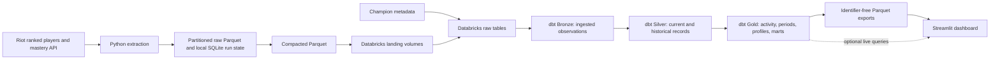

# League Specialization ETL

How does concentrating play on a smaller set of champions relate to ranked progression in League of Legends?

This project collects repeated ranked-player and champion-mastery snapshots, builds analytical tables in Databricks with dbt, and serves the results in a Streamlit dashboard. Its aim is to describe relationships between champion-pool choices and ranked outcomes in the **tracked sample**. An association in these data does not establish that specialization caused a player to climb.

The project also explores the engineering needed to make those comparisons possible: API rate limits, concurrent extraction, recoverable state, historical modeling, data quality checks, and a public serving layer that excludes player identifiers.

## What the project answers

- How concentrated are players' current, lifetime, and observed-period champion pools?
- How does concentration relate to rank movement within comparable starting tiers?
- How do players associated with a champion differ by tier, inferred role, playstyle, mastery depth, and observed growth?
- Which champions tend to coexist in the same players' active pools?

The original research brief also called for examining mastery, win rate, recent activity, champion population across tiers, and champion selection patterns. The implemented views cover parts of that brief through the available snapshots and derived marts; they should not be read as a complete answer to every original question.

These are descriptive questions. The data contain rank snapshots and cumulative mastery, rather than a joined record of each ranked match, champion, lane, and result. Champion attribution, ranked-mastery share, and roles are estimates built from those observations.

## Current state

The repository contains an end-to-end **extract, load, transform, and serve** path:

| Part | Implemented here | Detail |
|---|---|---|
| Collection | Riot API player and mastery extraction, local state and integrity checks, stale-player refresh | [Extraction code](src/extract/) |
| Loading | Parquet compaction, Databricks landing-volume uploads, champion metadata load, and a Databricks ingestion notebook | [Loading code](src/load/) |
| Transformation | dbt Bronze, Silver, and Gold models, schema tests, and business-rule tests | [dbt project README](league_pipeline/README.md) |
| Presentation | Streamlit Overview, Population Analysis, Cross Champion View, and Champion Explorer, using included Parquet exports by default | [Dashboard README](streamlit_app/README.md) |
| Orchestration definition | A Databricks job definition for ingestion and layer-by-layer dbt builds | [Job definition](resources/ingest_clean_transform.job.yml) |

The included dashboard files are a **snapshot**, not a live feed. Their export timestamp and coverage are recorded in the [snapshot manifest](streamlit_app/data/manifest.json). The dbt README records the most recent documented full and incremental build; those results describe that validation run, not every future run. The job definition is present in the repository; its deployment status is not established by the files alone.

## Data flow



The extractor scans configured ranked tiers and divisions, fetches mastery for discovered players, and revisits stale players. It records runs, tasks, files, and failures in local SQLite. A separate Postgres player registry supports freshness and refresh claims across collection cycles. Before upload, raw Parquet files are compacted. The Databricks ingestion notebook loads landed player and mastery files into raw tables; champion names and reference positions are loaded separately.

dbt preserves useful history and produces current records, rank periods, champion activity, player profiles, and champion marts. Fixed export queries create the public dashboard datasets and exclude player and interval identifiers. The optional live dashboard mode reads the Gold schema directly. See the [model reference](league_pipeline/docs/model_reference.md) for model grains, lineage, metric definitions, and interpretation edge cases.

## Analytical method

1. **Observe repeated snapshots.** Ranked entries provide tier, division, LP, and cumulative wins and losses. Champion-mastery entries provide cumulative mastery points and last-play information. Differences between snapshots, not individual match events, supply the historical activity signal.
2. **Measure rank movement.** A project-defined rank score allows movement across division boundaries. Completed observations are grouped into configured seven-day rank periods. Eligible growth is reported as LP per recorded ranked game, then compared with the tracked sample's baseline for the same queue and starting tier. The current growth filter excludes periods with absolute movement above 50 LP per game.
3. **Describe specialization.** The models calculate leading-champion share, concentration, entropy, and a favoured-champion subset for active, lifetime, or period pools. A weighted, configurable heuristic assigns one of four pool labels: specialist, multispecialist, versatile, or generalist. These labels describe the measured pool shape, not player skill.
4. **Associate champions with outcomes.** Mastery gained during a period supplies weights for allocating that period's rank movement and games to favoured champions. The resulting champion figures are associations, not observed wins or LP earned while playing that champion. Champion summaries first aggregate within players so those with many periods do not automatically dominate the final average.
5. **Compare and inspect.** Gold marts summarize players, champions, tiers, playstyles, and champion-pair overlap. The dashboard exposes support counts and controls for sparse groups. Co-occurrence measures shared player preference, not team synergy.

The precise formulas, thresholds, model grains, and edge cases live in the [dbt model reference](league_pipeline/docs/model_reference.md) and [dbt configuration](league_pipeline/dbt_project.yml). Dashboard-specific reading guidance is in the [dashboard README](streamlit_app/README.md).

## Engineering choices visible in the code

| Choice | Reason it matters |
|---|---|
| Persist extraction runs, tasks, and file status in SQLite | Supports inspection and recovery of partial local work instead of assuming each collection pass starts from nothing. |
| Keep a separate Postgres player registry | Allows previously loaded players to be revisited when stale and refresh work to be claimed across runs. |
| Respect API limits with synchronized token buckets and retry handling | Lets concurrent collection proceed while accounting for Riot's reported limits and transient failures. |
| Retain raw observations, then model history in dbt | Keeps source evidence and makes current-record selection and historical assumptions testable. |
| Use explicit, configurable heuristics for pools and rank periods | Makes definitions inspectable and revisable; they are analytical choices rather than game-provided facts. |
| Export fixed, identifier-free dashboard datasets | Keeps the public app independent of warehouse availability and avoids publishing player identifiers in its serving files. |

These are implementation choices evidenced by the repository. The motivations, alternatives, and lessons behind them are still open for the project author to add.

## Try the dashboard

The quickest local entry point uses the included snapshot and requires no Riot key or warehouse connection:

```powershell
python -m venv .venv
.\.venv\Scripts\python.exe -m pip install -r streamlit_app\requirements.txt
cd streamlit_app
..\.venv\Scripts\python.exe -m streamlit run app.py
```

See the [dashboard README](streamlit_app/README.md) for pages, snapshot refresh, optional Databricks mode, and dashboard tests. The [project-page proposal](streamlit_app/docs/project_page_proposal.md) is a draft for a future explanatory page; it is not currently one of the dashboard pages.

## Work on the pipeline

The full collection and warehouse path needs a Riot API key, a Databricks workspace and SQL warehouse, and a Postgres `DATABASE_URL` for the player registry. The code reads local configuration from `config/EXTRACTION_CONFIG.env`, `config/DATABRICKS_CONFIG.env`, and `.env.local`; the first two have [extraction](config/EXTRACTION_CONFIG.env.example) and [Databricks](config/DATABRICKS_CONFIG.env.example) examples. Keep credentials out of Git.

The current `requirements.txt` is a record of the development environment, not a verified clean-install lockfile: it contains an editable Git dependency, while the champion metadata loader imports `lupa` without listing it there. After preparing the required dependencies and configuration, run the extractor with `src` on the Python path:

```powershell
$env:PYTHONPATH = "src"
python -m extract.run_pipeline
```

That command performs collection, stale-player refresh, periodic compaction, and upload as configured. It is an environment-dependent data collection run, not a small demo command. The repository also contains the [ingestion notebook](src/load/ingest_players.ipynb) and a [Databricks job definition](resources/ingest_clean_transform.job.yml) for loading raw tables and building dbt layers.

For a configured `league_pipeline` dbt profile, run from the project directory:

```powershell
cd league_pipeline
dbt deps
dbt build
```

Use `dbt build --full-refresh` when changing the grain, unique key, or relevant schema of incremental history models. The [dbt README](league_pipeline/README.md) records the validated build context and details. To refresh the dashboard snapshot after a successful Gold build, follow the [export instructions](streamlit_app/README.md#refresh-the-snapshot).

## Verification and limits

Extraction tests cover configuration, file output, state operations, pagination, concurrency, and integrity behavior. dbt tests check source and model contracts plus reconciliation rules such as current-record selection, rank-period consistency, and mastery attribution. Dashboard tests cover metrics, snapshot contracts, and page rendering. Run local Python checks from the repository root with `python -m pytest src/extract/tests streamlit_app/tests`; warehouse validation requires its own configured dbt build.

The tests check properties of the implementation; they do not make the tracked players a random sample or turn mastery into match-level evidence. Region, queue, tiers, dates, short observation windows, patch changes, and small groups can all affect comparisons. An inferred role is not an observed lane, and the ranked-mastery share is an estimate rather than a measured percentage of ranked matches. Interpret dashboard results with their denominators, support counts, and snapshot dates.

## Documentation map

- [dbt project README](league_pipeline/README.md): layers, main outputs, and recorded build validation.
- [dbt model reference](league_pipeline/docs/model_reference.md): table-by-table grain, lineage, formulas, and edge cases.
- [dashboard README](streamlit_app/README.md): run modes, page guide, chart conventions, and export process.
- [dashboard editorial review](streamlit_app/docs/dashboard_review.md): design and wording decisions already made, plus proposed follow-ups.
- [About the project page proposal](streamlit_app/docs/project_page_proposal.md): draft copy and scope for a possible future app page.

## License and attribution

Released under the [MIT License](LICENSE). This is an independent project using Riot Games API services. League of Legends and Riot Games are trademarks of Riot Games, Inc.; the project is not affiliated with or endorsed by Riot Games.
