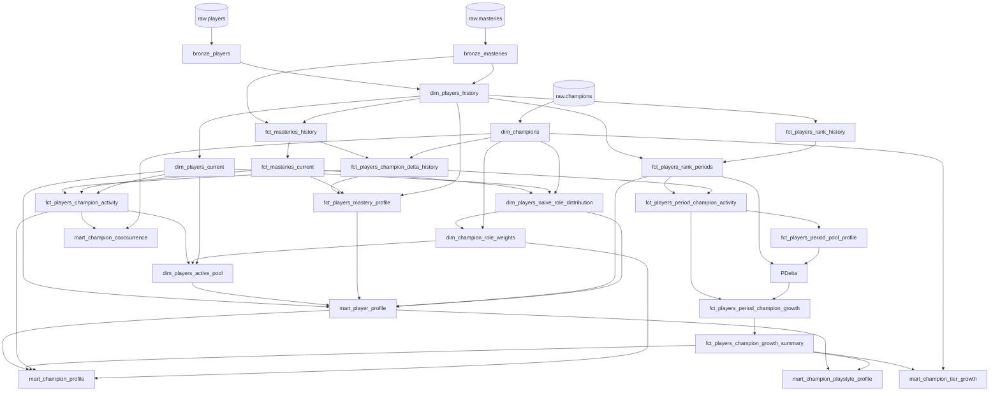

# League Pipeline Model Reference

This document explains why each dbt model exists, what one row represents, how it connects to the rest of the project, and which assumptions matter when interpreting its output.

## Analytical objective

The transformation layer is designed to answer four related questions:

1. What does each player's current and lifetime champion specialization look like?
2. How does a player's rank change during periods associated with different champions and playstyles?
3. How high and how quickly do players associated with each champion tend to climb?
4. Which champions commonly appear together in active player pools?

The final marts are intentionally separated by grain:

| Mart | Grain | Primary purpose |
|---|---|---|
| `mart_player_profile` | Player | Current player profile with rank, form, role, and specialization |
| `mart_player_delta_history` | Player and completed rank period | Rank growth associated with the champions used during a period |
| `mart_champion_profile` | Champion | Overall champion population, rank, growth, mastery, and role profile |
| `mart_champion_tier_growth` | Champion, starting tier, and optional playstyle | Player-equal growth within a tier |
| `mart_champion_playstyle_profile` | Champion and playstyle | Comparison of a champion's results across player archetypes |
| `mart_champion_cooccurrence` | Unordered champion pair | Strength and frequency of active-pool overlap |

## Lineage overview



## Shared analytical concepts

### Rank score

`rank_score` converts tier, division, and league points into one continuous analytical scale so movement can be measured across division boundaries. Iron through Diamond receive fixed 400-point tier bands. Master, Grandmaster, and Challenger share the same base and retain their uncapped league points.

This is an analytical convenience, not a Riot-provided rating. In the apex tiers, the displayed tier is determined by leaderboard cutoffs; `rank_score` therefore does not add an artificial jump between Master, Grandmaster, and Challenger.

### Champion-pool concentration

The same concentration vocabulary is used for active, lifetime, and period-specific pools:

| Metric | Meaning |
|---|---|
| `top1_share` | Share belonging to the largest champion |
| `favoured_champion_count` | Number of champions before the strongest qualifying log gap |
| `favoured_champions_share` | Combined share belonging to those favoured champions |
| `hhi` | Sum of squared shares; higher values indicate greater concentration |
| `entropy` | Raw Shannon entropy of the distribution |
| `normalized_entropy` | Entropy divided by the maximum possible entropy for the observed pool size |

Normalized entropy describes evenness, not breadth. Two equally represented champions and ten equally represented champions both have normalized entropy near one. Favoured count provides the missing breadth signal. Calculated values are clamped to `[0, 1]` to remove floating-point drift beyond the metric's mathematical bounds.

### Favoured-pool boundary

Champions are ordered by mastery points or points gained. The model examines at most the first `favoured_champion_max_count` champions, currently ten, and calculates the natural-log ratio between adjacent champions.

A boundary is accepted when the largest gap:

- is at least `favoured_champion_min_log_gap`, currently `ln(2)`;
- and is at least `favoured_champion_gap_multiplier`, currently 1.5, times the player's median adjacent gap.

Two-champion pools and zero-median cases receive explicit handling. When no gap qualifies, favoured count becomes the number of inspected candidates, capped at ten. Favoured share is still calculated against the entire distribution, so it can be below one for pools larger than ten.

### Playstyle classification

The four archetypes are `specialist`, `multispecialist`, `versatile`, and `generalist`. Each receives a weighted similarity score based on:

- top-one share;
- favoured-champion share;
- HHI;
- normalized entropy;
- normalized favoured-champion count.

The highest score wins. Ties are resolved in the order specialist, multispecialist, versatile, then generalist because of the SQL `CASE` order. The profiles and feature weights live in `dbt_project.yml` and are intentionally configurable.

This is a deterministic analytical heuristic, not a trained clustering model. The individual scores and log-gap diagnostics remain in supporting models for auditability; final marts expose the selected archetype and the interpretable concentration measures.

### Role inference

Role inference is a two-stage, non-recursive process:

1. `dim_players_naive_role_distribution` uses the expected positions of a player's recently used champions to create an initial player-role distribution.
2. `dim_champion_role_weights` averages the role distributions of players associated with each champion, producing empirical champion-role weights.

`dim_players_active_pool` then weights those empirical champion roles by current pool activity. This helps resolve ambiguous metadata positions using observed player associations. It does not identify the lane played in a specific match, because match-level position data is not available.

## Bronze models

### `bronze_players`

**Purpose.** Preserve the latest ingested copy of each raw ranked-player observation while retaining the source schema for downstream normalization.

**Grain and materialization.** One row per `puuid`, `queueType`, and source `date`; incremental Delta table using merge.

**Lineage.** Upstream: `source('raw', 'players')`. Downstream: `dim_players_history`.

**Columns.** All raw player columns are passed through. The columns relied upon downstream are:

| Column | Meaning |
|---|---|
| `puuid` | Riot player identifier |
| `region` | Platform routing region |
| `queueType` | Ranked queue identifier |
| `tier`, `rank`, `leaguePoints` | Displayed ranked position |
| `wins`, `losses` | Cumulative ranked counters |
| `patch` | Patch attached by extraction |
| `date` | Source snapshot date encoded as `yyMMdd` |
| `_ingested_at` | Load timestamp used to keep the latest duplicate |

**Technical notes and edge cases.** Same-day updates for the same player and queue collapse to the latest ingestion. The model deliberately uses explicit snapshot keys rather than a hash. Because it passes through the raw schema, unexpected source columns can also appear here.

### `bronze_masteries`

**Purpose.** Preserve the latest ingested copy of each raw player-champion mastery observation.

**Grain and materialization.** One row per `puuid`, `championId`, and source `date`; incremental Delta table using merge.

**Lineage.** Upstream: `source('raw', 'masteries')`. Downstream: `dim_players_history`, `fct_masteries_history`.

**Columns.** All raw mastery columns are passed through. The columns relied upon downstream are:

| Column | Meaning |
|---|---|
| `puuid` | Riot player identifier |
| `championId` | Champion identifier |
| `championPoints` | Cumulative mastery points |
| `lastPlayTime` | Epoch-millisecond timestamp of the most recent recorded play |
| `region`, `patch`, `date` | Snapshot metadata |
| `_ingested_at` | Load timestamp used for deduplication |

**Technical notes and edge cases.** Same-day duplicates collapse to the latest ingestion. Mastery points are cumulative and may occasionally decrease because of corrections or source inconsistencies; downstream models treat positive and negative deltas differently depending on purpose.

## Silver models

### `dim_champions`

**Purpose.** Provide one canonical champion lookup with a reconciled set of expected positions.

**Grain and materialization.** One row per champion `key`; Delta table.

**Lineage.** Upstream: `source('raw', 'champions')`. Downstream: role models, champion delta/activity facts, and champion marts.

| Column | Meaning |
|---|---|
| `key` | Numeric champion key used by mastery data |
| `name` | Display name |
| `id` | Riot string identifier |
| `client_positions` | Positions supplied by the game client source |
| `external_positions` | Positions supplied by the secondary source |
| `expected_positions` | Reconciled position array used to seed role inference |
| `patch` | Champion metadata patch |

**Technical notes and edge cases.** Bottom-lane client classification is forced to `Bottom`, and a client-only `Jungle` classification is preserved. Other cases use the distinct union of both position arrays. This is seed metadata, not the final empirical role distribution.

### `dim_players_history`

**Purpose.** Normalize ranked player snapshots into the canonical historical player dimension used throughout the project.

**Grain and materialization.** One row per player, ranked queue, and snapshot date; incremental Delta table using merge.

**Lineage.** Upstream: `bronze_players`, `bronze_masteries`. Downstream: player current state, mastery history, activity, mastery profile, and rank history.

| Column | Meaning |
|---|---|
| `player_history_id` | Surrogate key for player and snapshot date |
| `puuid` | Player identifier |
| `region`, `queue`, `patch` | Snapshot context |
| `tier`, `division`, `league_points` | Normalized ranked position; division is numeric I=1 through IV=4 |
| `wins`, `losses`, `total_games`, `win_rate` | Cumulative ranked outcomes at the snapshot |
| `snapshot_date` | Parsed calendar date |

**Technical notes and edge cases.** Only `ranked_queue`, currently solo queue, is retained. A player snapshot is accepted only when mastery data exists within `mastery_freshness_days`, currently two days. Late-arriving records older than `late_arrival_lookback_days` are not reconsidered during an ordinary incremental run and require a full refresh.

### `dim_players_current`

**Purpose.** Expose the latest known ranked state for each tracked player and queue without maintaining a separate validity-period layer.

**Grain and materialization.** One row per player and queue; Delta table.

**Lineage.** Upstream: `dim_players_history`. Downstream: current player, role, activity, and mastery-profile models.

**Columns.** Same columns as `dim_players_history`.

**Technical notes and edge cases.** “Current” means latest observed for that player, not necessarily observed on the global latest date. Consumers should use `snapshot_date` when freshness differences matter.

### `fct_masteries_history`

**Purpose.** Normalize cumulative mastery snapshots and retain their history for delta calculation.

**Grain and materialization.** One row per player, champion, and snapshot date; incremental Delta table using merge.

**Lineage.** Upstream: `bronze_masteries`, `dim_players_history`. Downstream: `fct_masteries_current`, `fct_players_champion_delta_history`.

| Column | Meaning |
|---|---|
| `mastery_history_id` | Surrogate key for player, champion, and snapshot date |
| `puuid` | Player identifier |
| `champion_key` | Champion identifier |
| `champion_points` | Cumulative mastery points |
| `last_play_time` | Last-play timestamp converted from milliseconds |
| `snapshot_date`, `patch` | Snapshot context |

**Technical notes and edge cases.** Only players that exist in player history and champion IDs present in the standard champion dimension are retained. The mastery API can emit separate mode-specific IDs, including League Classic variants in the `60000 + base champion ID` range. These records are preserved in raw and bronze but excluded here: their mastery points are independent from the base champion's points, so remapping them onto the base ID would distort champion-pool metrics. The mastery snapshot itself does not have to share an exact date with a rank snapshot. Late records outside the incremental lookback, or records for a standard champion added to the dimension after they fell outside that lookback, require a full refresh.

### `fct_masteries_current`

**Purpose.** Expose the latest mastery state for every tracked player-champion pair.

**Grain and materialization.** One row per player and champion; Delta table.

**Lineage.** Upstream: `fct_masteries_history`. Downstream: role inference, champion activity, lifetime mastery profile, and champion profile.

**Columns.** Same columns as `fct_masteries_history`.

**Technical notes and edge cases.** Each champion is selected independently, so a player's champion rows can originate from different snapshot dates.

## Gold supporting models

### `fct_players_champion_delta_history`

**Purpose.** Convert cumulative mastery snapshots into observed mastery movement by player and champion.

**Grain and materialization.** One row per player, champion, and non-zero observed mastery interval; Delta table.

**Lineage.** Upstream: `fct_masteries_history`, `dim_champions`. Downstream: champion activity, lifetime mastery profile, and period-pool profile.

| Column | Meaning |
|---|---|
| `champion_delta_id` | Surrogate interval key |
| `player_id`, `champion_key`, `champion_name` | Player and champion identity |
| `previous_snapshot_date`, `snapshot_date`, `days_period` | Interval bounds and length |
| `previous_champion_points`, `champion_points` | Cumulative values at both ends |
| `points_delta`, `points_per_day` | Observed mastery change and daily rate |
| `last_play_time` | Last-play timestamp at the ending snapshot |

**Technical notes and edge cases.** Zero-change intervals are omitted. Negative deltas are retained here as evidence of corrections, but current activity and period-pool attribution use only positive deltas.

### `fct_players_champion_activity`

**Purpose.** Decide which mastered champions belong to each player's current active pool.

**Grain and materialization.** One row per player and champion present in current mastery data; Delta table.

**Lineage.** Upstream: `dim_players_current`, `dim_players_history`, `fct_masteries_current`, `fct_players_champion_delta_history`, `dim_champions`. Downstream: active-pool profile, champion profile, and co-occurrence mart.

| Column | Meaning |
|---|---|
| `player_champion_activity_id` | Surrogate player-champion key |
| `player_id`, `champion_key`, `champion_name` | Identity fields |
| `as_of_date` | Latest player snapshot date in the dataset |
| `recent_champion_points` | Positive mastery gained by this champion inside the activity window |
| `recent_total_points` | Positive mastery gained by the player across champions |
| `recent_share` | Champion share of recent mastery gains |
| `days_tracked` | Span between the player's first and latest rank snapshots |
| `days_since_last_play` | Days between `as_of_date` and the champion's last-play timestamp |
| `is_active` | Whether the champion passes the mature or immature-player rule |

**Technical notes and edge cases.** Mature players must pass recency plus the greater of an absolute, tracking-adjusted threshold and a relative-share threshold. Players tracked for less than half the activity window use a recency-only rule because insufficient delta history would otherwise exclude their pool. The model includes only champions present in mastery data and does not create a player-by-all-champions Cartesian product.

### `dim_players_naive_role_distribution`

**Purpose.** Build the metadata-seeded role distribution used as the first stage of empirical role inference.

**Grain and materialization.** One row per current player; Delta table.

**Lineage.** Upstream: `fct_masteries_current`, `dim_champions`, `dim_players_current`. Downstream: `dim_champion_role_weights`, `mart_player_profile`.

| Column | Meaning |
|---|---|
| `player_id` | Player identifier |
| `champions_sample` | Up to the configured number of most recently played champion keys |
| `champions_sampled_count` | Size of the sample |
| `primary_roles` | All roles tied for the largest metadata-seeded count |
| `top_pct`, `jungle_pct`, `middle_pct`, `bottom_pct`, `support_pct` | Initial role distribution |

**Technical notes and edge cases.** The default sample is the 15 most recently played champions, breaking recency ties by mastery points. A multi-position champion contributes to every listed expected position; percentages are normalized over all resulting role entries. Players without valid champion-role metadata receive empty samples or null percentages.

### `dim_champion_role_weights`

**Purpose.** Infer actual champion lane tendencies from the role distributions of players associated with each champion.

**Grain and materialization.** One row per champion; Delta table.

**Lineage.** Upstream: `dim_players_naive_role_distribution`, `dim_champions`. Downstream: `dim_players_active_pool`, `mart_champion_profile`.

| Column | Meaning |
|---|---|
| `champion_key`, `champion_name` | Champion identity |
| `player_count` | Players whose recent sample contains the champion |
| `avg_top_pct`, `avg_jungle_pct`, `avg_middle_pct`, `avg_bottom_pct`, `avg_support_pct` | Empirical role weights |

**Technical notes and edge cases.** This is association-based inference, not direct match-position observation. Small `player_count` values imply unstable estimates. The model is not recursive: champion metadata seeds player roles once, after which player associations produce champion weights.

### `dim_players_active_pool`

**Purpose.** Summarize each player's current active champions into an interpretable specialization, playstyle, and empirical role profile.

**Grain and materialization.** One row per current player; Delta table.

**Lineage.** Upstream: `fct_players_champion_activity`, `dim_champion_role_weights`, `dim_players_current`. Downstream: `mart_player_profile`.

| Column group | Columns and meaning |
|---|---|
| Identity/freshness | `player_id`, `as_of_date`, `days_tracked` |
| Activity | `recent_total_points`, `is_active`, `active_champion_names`, `active_champion_count` |
| Primary champion | `primary_champion_key`, `primary_champion_name` |
| Concentration | `pool_top1_share`, `pool_favoured_champion_count`, `pool_favoured_champions_share`, `pool_favoured_log_gap`, `pool_hhi`, `pool_entropy`, `pool_normalized_entropy` |
| Classification audit | `specialist_score`, `multispecialist_score`, `versatile_score`, `generalist_score`, `playstyle` |
| Role distribution | `role_top_pct`, `role_jungle_pct`, `role_middle_pct`, `role_bottom_pct`, `role_support_pct`, `role_purity`, `main_role`, `main_role_weight` |

**Technical notes and edge cases.** Recent mastery gains weight both pool shares and role shares. For immature players with no observed positive delta, active champions receive equal weight. `role_purity` is the HHI of the five role shares. `main_role` uses alphabetical order only when empirical weights tie exactly. Players without an active pool remain in the model with zero active champions and null concentration/classification values.

### `fct_players_mastery_profile`

**Purpose.** Describe lifetime champion specialization and observed mastery accumulation for each current player.

**Grain and materialization.** One row per current player; Delta table.

**Lineage.** Upstream: `dim_players_current`, `fct_masteries_current`, `dim_champions`, `fct_players_champion_delta_history`, `dim_players_history`. Downstream: `mart_player_profile`.

| Column group | Columns and meaning |
|---|---|
| Identity/freshness | `player_id`, `as_of_date` |
| Breadth/scale | `champions_with_mastery`, `total_mastery_points` |
| Primary champion | `top_champion_key`, `top_champion_name` |
| Concentration | `mastery_top1_share`, `mastery_favoured_champion_count`, `mastery_favoured_champions_share`, `mastery_favoured_log_gap`, `mastery_hhi`, `mastery_entropy`, `mastery_normalized_entropy` |
| Classification audit | `mastery_specialist_score`, `mastery_multispecialist_score`, `mastery_versatile_score`, `mastery_generalist_score`, `mastery_playstyle` |
| Recency/tracking | `last_play_time`, `days_since_last_play`, `days_tracked`, `snapshot_count`, `mastery_points_per_day` |

**Technical notes and edge cases.** Only champions with positive current mastery points participate in the distribution. `mastery_points_per_day` uses all retained mastery deltas, including negative corrections, divided by the span between the first and last observed delta endpoints. It is null when only one accrual date exists because the denominator is zero.

### `fct_players_rank_history`

**Purpose.** Convert cumulative rank snapshots into player-period rank and game movement.

**Grain and materialization.** One row per player, queue, and consecutive snapshot interval; Delta table.

**Lineage.** Upstream: `dim_players_history`. Downstream: `fct_players_rank_periods`.

| Column group | Columns and meaning |
|---|---|
| Key/context | `rank_delta_id`, `player_id`, `region`, `queue` |
| Starting rank | `previous_tier`, `previous_division`, `previous_league_points`, `previous_rank_score` |
| Ending rank | `tier`, `division`, `league_points`, `rank_score` |
| Interval | `previous_snapshot_date`, `snapshot_date`, `period_in_days` |
| Movement | `wins_delta`, `losses_delta`, `games_delta`, `lp_delta`, `is_counter_reset` |

**Technical notes and edge cases.** Negative win or loss deltas mark season/split counter resets. LP movement can include decay, penalties, or API corrections and should not always be interpreted as match-derived change. Snapshot intervals are not guaranteed to have equal duration.

### `fct_players_rank_periods`

**Purpose.** Provide a single, non-overlapping weekly rank history for player form and champion growth analysis.

**Grain and materialization.** One row per player, queue, and completed period with an endpoint in the preceding bucket; Delta table.

**Lineage.** Upstream: `dim_players_history`, `fct_players_rank_history`. Downstream: `mart_player_profile`, `fct_players_period_pool_profile`, and `mart_player_delta_history`.

| Column group | Columns and meaning |
|---|---|
| Key/context | `rank_period_id`, `player_id`, `region`, `queue` |
| Starting rank | `previous_tier`, `previous_division`, `previous_league_points`, `previous_rank_score` |
| Ending rank | `tier`, `division`, `league_points`, `rank_score` |
| Period | `previous_snapshot_date`, `snapshot_date`, `period_bucket_start`, `period_bucket_end`, `period_bucket_days`, `period_in_days` |
| Movement | `wins_delta`, `losses_delta`, `games_delta`, `lp_delta` |

**Technical notes and edge cases.** With `rank_period_days: 7`, buckets run Monday through Sunday. The latest observed snapshot in each completed bucket is compared with the endpoint in the immediately preceding bucket. The observed endpoints must be six to eight days apart; this avoids treating a Sunday-to-Monday change as weekly growth. A missing week or detected win/loss counter reset breaks the sequence. The first bucket for a player provides a baseline endpoint, not a period row.

### `fct_players_period_champion_activity`

**Purpose.** Retain each champion's positive mastery gain and favoured status in a completed rank period before the pool is summarized.

**Grain and materialization.** One row per rank period and champion with positive observed mastery movement; Delta table.

**Lineage.** Upstream: `fct_players_rank_periods`, `fct_players_champion_delta_history`. Downstream: `fct_players_period_pool_profile`, `fct_players_period_champion_growth`.

| Column group | Columns and meaning |
|---|---|
| Key | `rank_period_id`, `champion_key`, `champion_name` |
| Activity | `points_gained`, `champion_share`, `points_rank` |
| Favoured boundary | `favoured_champion_count`, `favoured_log_gap`, `is_favoured` |

**Technical notes and edge cases.** `champion_share` uses all positive mastery movement in the period as its denominator. Shares across all champions sum to one. Shares for favoured champions may sum to less than one; the remainder is not assigned to favoured champions. Mastery and rank collection schedules can differ, so a mastery delta whose ending snapshot falls in the period may include activity outside its exact rank dates.

### `fct_players_period_pool_profile`

**Purpose.** Attribute positive mastery gained during each rank period to champions and classify that period's observed pool behavior.

**Grain and materialization.** One row per rank period with positive champion mastery movement; Delta table.

**Lineage.** Upstream: `fct_players_period_champion_activity`. Downstream: `mart_player_delta_history`.

| Column group | Columns and meaning |
|---|---|
| Key | `rank_period_id` |
| Pool scale | `champion_count`, `mastery_points_gained` |
| Primary champion | `primary_champion_key`, `primary_champion_name`, `primary_champion_points` |
| Concentration | `top1_share`, `favoured_champion_count`, `favoured_champions_share`, `favoured_log_gap`, `hhi`, `entropy`, `normalized_entropy` |
| Classification audit | `specialist_score`, `multispecialist_score`, `versatile_score`, `generalist_score`, `playstyle` |

**Technical notes and edge cases.** A mastery delta is assigned when its ending snapshot falls after the previous rank endpoint and on or before the current endpoint. Because mastery and rank collection schedules can differ, that delta may represent activity spanning beyond the rank period. Negative mastery movement is excluded. Periods without positive mastery movement have no pool row and remain present in the delta mart with null pool metrics.

## Final marts

### `mart_player_profile`

**Purpose.** Provide the main current player-level analytical record. It combines rank height, recent form, empirical role usage, current active-pool specialization, and lifetime mastery without exposing internal classification scores.

**Grain and materialization.** One row per current player; Delta table.

**Lineage.** Upstream: `dim_players_current`, `dim_players_active_pool`, `fct_players_mastery_profile`, `fct_players_rank_periods`, `dim_players_naive_role_distribution`. Downstream: both champion profile marts.

| Column group | Columns and meaning |
|---|---|
| Identity/freshness | `player_id`, `as_of_date`, `snapshot_date`, `region`, `queue`, `patch` |
| Current rank | `tier`, `tier_order`, `division`, `league_points`, `rank_score`, `total_games`, `win_rate` |
| Recent form | `form_window_days`, `games_recent`, `lp_delta_recent`, `win_rate_recent`, `lp_per_game_recent`, `lp_per_day_recent`, `games_per_day_recent`, `form_days_covered` |
| Empirical role | `role_top_pct`, `role_jungle_pct`, `role_middle_pct`, `role_bottom_pct`, `role_support_pct`, `role_purity`, `main_role`, `main_role_weight` |
| Role seed/audit | `metadata_primary_roles`, `role_champions_sampled_count` |
| Active pool | `active_champion_count`, `recent_total_points`, `active_primary_champion_key`, `active_primary_champion_name`, `active_playstyle`, `active_top1_share`, `active_favoured_champion_count`, `active_favoured_champions_share`, `active_hhi`, `active_normalized_entropy`, `active_champion_names` |
| Lifetime mastery | `champions_with_mastery`, `total_mastery_points`, `top_champion_key`, `top_champion_name`, `alltime_top1_share`, `alltime_favoured_champion_count`, `alltime_favoured_champions_share`, `alltime_hhi`, `alltime_normalized_entropy`, `alltime_playstyle`, `alltime_points_per_day`, `days_since_last_play`, `days_tracked` |

**Technical notes and edge cases.** Active and all-time playstyles answer different questions and can legitimately disagree. `metadata_primary_roles` preserves ties from the first-stage role inference, while `main_role` is derived from empirically weighted active champions. Recent form uses the latest completed rank bucket available in the dataset. Its nominal window is seven days by default, while rates use the actual six-to-eight-day span between observed endpoints. Recent form excludes rank periods beyond the configured absolute LP-per-game growth bound. Players without an eligible period in that latest bucket have null form values, not zero performance.

### `mart_player_delta_history`

**Purpose.** Provide the main longitudinal dataset for studying how champion choice and playstyle relate to rank growth.

**Grain and materialization.** One row per valid completed player rank period; Delta table.

**Lineage.** Upstream: `fct_players_rank_periods`, `fct_players_period_pool_profile`. Downstream: `fct_players_period_champion_growth`.

| Column group | Columns and meaning |
|---|---|
| Key/context | `rank_period_id`, `player_id`, `region`, `queue` |
| Starting rank | `previous_tier`, `previous_division`, `previous_league_points`, `previous_rank_score` |
| Ending rank | `tier`, `division`, `league_points`, `rank_score` |
| Interval/outcome | `previous_snapshot_date`, `snapshot_date`, `period_bucket_start`, `period_bucket_end`, `period_bucket_days`, `period_in_days`, `wins_delta`, `losses_delta`, `games_delta`, `lp_delta` |
| Observed champion pool | `champion_count`, `mastery_points_gained`, `primary_champion_key`, `primary_champion_name`, `primary_champion_points`, `pool_top1_share`, `pool_favoured_champion_count`, `pool_favoured_champions_share`, `pool_hhi`, `pool_normalized_entropy`, `playstyle` |
| Comparative rates | `is_lp_growth_eligible`, `tier_lp_per_game_baseline`, `lp_per_game`, `lp_per_day`, `period_win_rate`, `lp_per_game_lift_vs_tier` |
| Estimated queue mix | `expected_ranked_mastery_points`, `estimated_ranked_mastery_share` |

**Technical notes and edge cases.** The tier baseline is calculated inside the observed dataset by queue and starting tier; it is not an external population benchmark. Periods above the configurable absolute LP-per-game bound (50 by default) remain inspectable with raw rank movement, but do not contribute to tier baselines or champion growth, and their tier-adjusted lift is null. This heuristic can also exclude unusual genuine performance. `lp_per_game_lift_vs_tier` is descriptive, not causal. Periods without positive mastery movement retain their rank outcome but have null champion-pool fields. `estimated_ranked_mastery_share` divides assumed mastery earned from ranked wins and losses by all observed positive mastery gained in the period, then clamps the result to `[0, 1]`. The default assumptions are 1,000 mastery points per ranked win and 300 per loss in `dbt_project.yml`. It estimates a share of mastery points, not a share of games; it is null when the period has no positive mastery or ranked games.

### `fct_players_period_champion_growth`

**Purpose.** Attribute each valid rank period's observed growth to all favoured champions using their share of positive mastery gain.

**Grain and materialization.** One row per rank period and favoured champion with games and a starting-tier baseline; Delta table.

**Lineage.** Upstream: `fct_players_period_champion_activity`, `mart_player_delta_history`. Downstream: `fct_players_champion_growth_summary`.

| Column group | Columns and meaning |
|---|---|
| Context | `rank_period_id`, `player_id`, `queue`, `previous_tier`, `period_bucket_start`, `period_in_days`, `playstyle` |
| Champion | `champion_key`, `champion_name`, `points_gained`, `points_rank`, `attribution_share` |
| Period outcomes | `games_delta`, `wins_delta`, `lp_delta`, `tier_lp_per_game_baseline`, `lp_per_game`, `lp_per_day`, `period_win_rate`, `lp_per_game_lift_vs_tier` |
| Estimated attribution | `attributed_games`, `attributed_wins`, `attributed_lp_delta`, `attributed_excess_lp` |
| Queue-mix estimate | `estimated_ranked_mastery_share` |

**Technical notes and edge cases.** Attributed outcomes multiply the period total by the champion's unrenormalized mastery share. `attributed_excess_lp` multiplies the tier-adjusted total LP by that share, so attribution and baseline adjustment reconcile. A champion's rate within one period is still the period rate; match-specific champion wins and LP are unavailable. Non-favoured mastery share remains unassigned.

### `fct_players_champion_growth_summary`

**Purpose.** Give each player one result per champion cohort before calculating champion-level outcomes.

**Grain and materialization.** One row per player and champion within each of four cohort scopes: champion; champion and observed playstyle; champion and starting tier; champion, starting tier, and observed playstyle. Delta table. The unused cohort dimensions are null.

**Lineage.** Upstream: `fct_players_period_champion_growth`. Downstream: both champion profile marts and `mart_champion_tier_growth`.

| Column group | Columns and meaning |
|---|---|
| Key/cohort | `player_champion_growth_id`, `player_id`, `champion_key`, `cohort_scope`, `starting_tier`, `cohort_playstyle` |
| Support | `observed_period_count`, `attributed_games` |
| Player outcomes | `player_win_rate`, `player_lp_per_game`, `player_lp_per_day`, `median_lp_per_game_lift_vs_tier`, `player_avg_end_rank_score`, `player_median_end_rank_score` |

**Technical notes and edge cases.** The LP/game lift median orders a player's qualifying period lifts and weights each period by the champion's mastery share. The first value crossing half the cumulative share is selected. Other player rates use attributed numerators and denominators. Champion marts average these player results, so each player contributes one vote within the chosen cohort. Tier-specific rows remain available even though the existing champion marts report the all-tier scopes.

### `mart_champion_profile`

**Purpose.** Provide one concise overall profile per champion: current active-pool popularity, rank height among primary players, observed growth, mastery depth, and empirical role usage.

**Grain and materialization.** One row per champion; Delta table.

**Lineage.** Upstream: `dim_champions`, `fct_players_champion_activity`, `mart_player_profile`, `fct_players_champion_growth_summary`, `fct_masteries_current`, `dim_champion_role_weights`. Downstream: none.

| Column group | Columns and meaning |
|---|---|
| Identity/freshness | `champion_key`, `champion_name`, `champion_patch`, `expected_positions`, `as_of_date` |
| Active popularity | `active_player_count`, `active_pool_player_count`, `active_play_rate`, `avg_active_pool_share` |
| Current primary players | `primary_player_count`, `recent_form_player_count`, `avg_current_rank_score`, `median_current_rank_score`, `avg_recent_lp_per_game`, `avg_recent_win_rate` |
| Observed growth | `observed_player_count`, `observed_period_count`, `attributed_games`, `observed_games`, `observed_win_rate`, `expected_lp_per_game`, `expected_lp_per_day`, `climbing_efficiency`, `avg_end_rank_score`, `median_end_rank_score` |
| Mastery | `mastery_player_count`, `expert_player_count`, `expert_player_share`, `avg_mastery_points`, `median_mastery_points` |
| Empirical roles | `role_sample_player_count`, `role_top_pct`, `role_jungle_pct`, `role_middle_pct`, `role_bottom_pct`, `role_support_pct` |

**Technical notes and edge cases.** Active play rate uses players with at least one active champion and positive recent mastery as its population. Primary-player metrics describe players whose current active pool is led by the champion. Growth metrics include every favoured champion in a period and average player-level results equally. `climbing_efficiency` is the mean player median LP/game lift. The Streamlit query translates this field to its existing `lp_per_game_lift_vs_tier` contract. `observed_games` is a compatibility alias for the fractional `attributed_games`, not a count of confirmed champion games. Win rate and LP rates are estimates derived from shared period outcomes.

### `mart_champion_tier_growth`

**Purpose.** Publish the player-equal champion growth comparison within each starting tier, with an optional observed playstyle split.

**Grain and materialization.** One row per champion and starting tier for `champion_tier`, plus one row per champion, starting tier, and observed playstyle for `champion_tier_playstyle`; Delta table. `playstyle` is null for the all-playstyle row.

**Lineage.** Upstream: `fct_players_champion_growth_summary`, `dim_champions`. Downstream: none.

| Column group | Columns and meaning |
|---|---|
| Key/cohort | `champion_tier_growth_id`, `champion_key`, `champion_name`, `starting_tier`, `playstyle`, `cohort_scope` |
| Support | `observed_player_count`, `observed_period_count`, `attributed_games` |
| Player-equal outcomes | `observed_win_rate`, `expected_lp_per_game`, `expected_lp_per_day`, `climbing_efficiency` |

**Technical notes and edge cases.** `climbing_efficiency` averages the weighted median LP/game lift of each player in that champion and starting-tier cohort. The playstyle split uses the classification observed in each rank period.

### `mart_champion_playstyle_profile`

**Purpose.** Show how the same champion's rank height and growth differ across specialist, multispecialist, versatile, and generalist players without widening the champion profile into repeated column groups.

**Grain and materialization.** One row per observed champion and playstyle combination; Delta table.

**Lineage.** Upstream: `mart_player_profile`, `fct_players_champion_growth_summary`, `dim_champions`. Downstream: none.

| Column group | Columns and meaning |
|---|---|
| Key/context | `champion_playstyle_id`, `as_of_date`, `champion_key`, `champion_name`, `playstyle` |
| Current players | `current_player_count`, `recent_form_player_count`, `avg_current_rank_score`, `median_current_rank_score`, `avg_recent_lp_per_game`, `avg_recent_win_rate` |
| Observed growth | `observed_player_count`, `observed_period_count`, `attributed_games`, `observed_games`, `observed_win_rate`, `expected_lp_per_game`, `expected_lp_per_day`, `climbing_efficiency`, `avg_end_rank_score`, `median_end_rank_score` |

**Technical notes and edge cases.** Only combinations observed in either the current player population or historical growth periods receive a row. Current metrics use active-pool playstyle; historical metrics use the champion distribution observed inside each completed rank period. Zero count means that side of the union had no observations; null averages mean no valid denominator.

### `mart_champion_cooccurrence`

**Purpose.** Measure which unordered champion pairs commonly coexist in current active player pools and whether that overlap is stronger than expected from their individual popularity.

**Grain and materialization.** One row per unordered champion pair meeting the configured minimum player count; Delta table.

**Lineage.** Upstream: `fct_players_champion_activity`, `dim_champions`. Downstream: none.

| Column | Meaning |
|---|---|
| `champion_pair_id` | Surrogate key for the unordered pair |
| `as_of_date` | Activity reference date |
| `champion_key_a`, `champion_name_a` | First champion; key is lower than B |
| `champion_key_b`, `champion_name_b` | Second champion |
| `pool_player_count` | Players with at least one active champion |
| `player_count_a`, `player_count_b` | Active-pool player counts for each champion |
| `pair_player_count` | Players whose active pool contains both champions |
| `jaccard` | Intersection divided by union |
| `prob_b_given_a`, `prob_a_given_b` | Directional conditional overlap probabilities |
| `lift` | Observed pair support divided by expected support under independence |
| `npmi` | Normalized pointwise mutual information in the range -1 to 1 |

**Technical notes and edge cases.** Pairs are filtered to at least `cooccurrence_min_pair_players`, currently five. Lift can be volatile for uncommon champions even after filtering. Co-occurrence indicates shared player preference, not gameplay synergy, matchup strength, or causal affinity.

## Operational guidance

Four models are incremental: `bronze_players`, `bronze_masteries`, `dim_players_history`, and `fct_masteries_history`. No model disables full refresh. Use a full refresh when changing their unique keys, historical grain, or columns relied upon by downstream models:

```powershell
dbt build --full-refresh
```

Deleting a model file does not remove its existing relation from Databricks. Obsolete relations must be dropped explicitly.

The final marts are tables rebuilt from their upstream state. Supporting diagnostic columns are deliberately retained outside the marts so classification behavior can be inspected without making analyst-facing tables unnecessarily wide.
